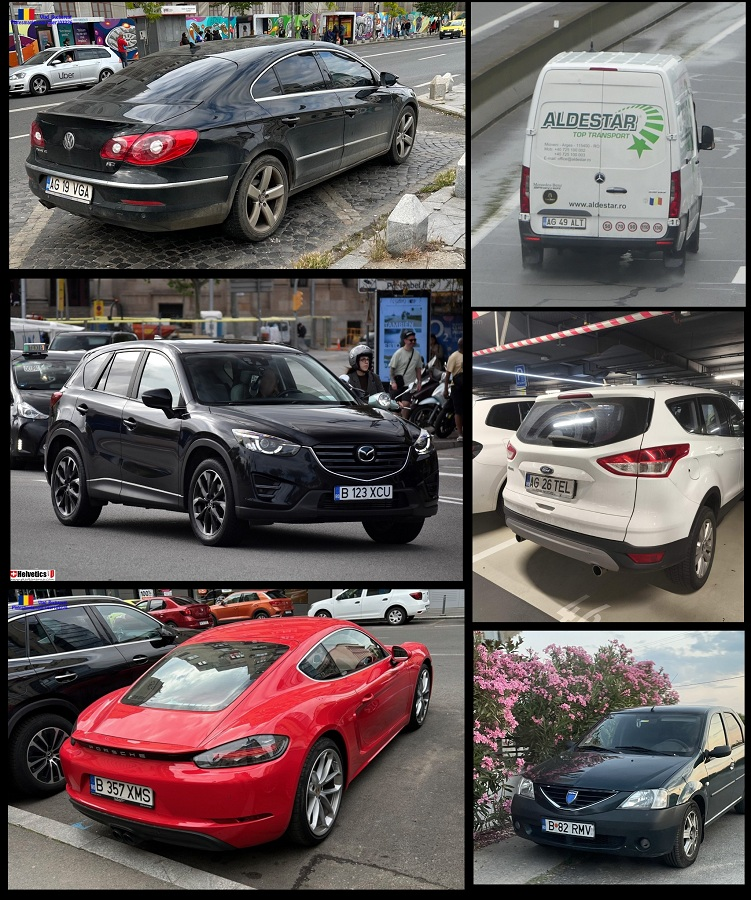
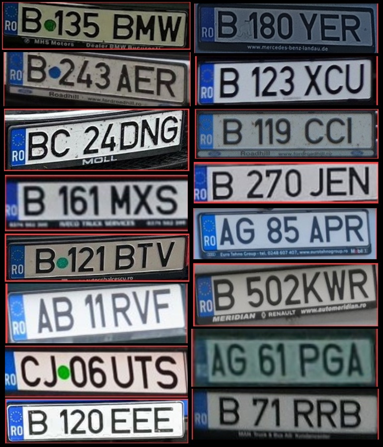

# LPSR-Degradation-Toolkit
This repository provides a systematic methodology for creating challenging license plate datasets. It allows for the programmatic generation of complex image artifacts, moving beyond simple noise to model environmental and optical conditions such as weather interference and motion blur. Focused on the creation and augmentation of training data for License Plate Super-Resolution (LPSR) models, the included module generates paired HR (High Resolution) and LR (Low Resolution) images by applying diverse image artifacts to original license plate photos.

## Repository content

* **`image_distortion_set.py`**: The main script used to automatically apply distortions using the Albumentations library.
* **`config.yaml`**: The settings file where you can configure the effects (motion blur, weather conditions, distance, perspective, etc.).
* **`source_images.txt`**: A text file containing direct links to the original high-resolution license plate images used for the dataset.

## Input Requirements 

The images referenced in **`source_images.txt`**  were sourced from PlatesMania, a specialized database of vehicle plates from actual traffic. To replicate the dataset or use the script effectively, please note the following pre-processing steps applied to the source data:

* ***Plate Extraction & Filtering***: Regions of interest (ROI) were localized and cropped using a [Roboflow](https://universe.roboflow.com/roboflow-universe-projects/license-plate-recognition-rxg4e) detector (97.2% mAP@50) with a confidence threshold > 70% and a validated aspect ratio between 3.0 and 6.0.

* ***Resolution & Upsampling***: The script enforces a minimum resolution threshold of 224 × 80 pixels. Any images falling below this limit are automatically upsampled using cubic interpolation prior to the degradation phase to ensure the stable execution of augmentation kernels like rain and snow.

<p align="center">
  
  
  <br>
  <em>Left: Full vehicle captures from PlatesMania (Source) Right: Extracted & Filtered ROI crops (Input)</em>
</p>

## Configuration

The toolkit is modular, with all distortion parameters managed through **`config.yaml`**. Each effect can be toggled and fine-tuned by adjusting its specific values and execution probability (`p`). For a comprehensive list of all available image augmentations and their technical parameters, please refer to the official [Albumentations Documentation](https://albumentations.ai/docs/).

### Available Distortion Effects

To better understand the degradation effects, the visual samples in the table below are generated from the following high-resolution crop:

<p align="center">
  
  <br>
  <em>Original HR License Plate (Ground Truth)</em>
</p>

| Effect ID | Description | Visual Sample | Albumentations Transforms |
|:---|:---|:---|:--- |
| **`MOTION`** | Motion blur simulation |  | `MotionBlur` | 
| **`DISTANCE`** | Simulates long-range capture |  | `Resize` + `Downscale` + `GaussianBlur` |
| **`SKEW`** | Perspective distortion |  | `Perspective` |
| **`OBSTRUCTION`** | Partial plate occlusions |  | `CoarseDropout` |
| **`DAY_RAIN`** | Rain in daylight conditions |  | `RandomRain` + `MotionBlur` |
| **`DAY_SNOW`** | Snow in daylight conditions |  | `RandomSnow` (bleach + texture) |
| **`NIGHT_RAIN`** | Night-time rain simulation |  | `RandomRain` + `Brightness/Contrast` + `GaussNoise` + `ToGray` |
| **`NIGHT_SNOW`** | Night-time snow simulation |  | `RandomSnow` + `Brightness/Contrast` + `GaussNoise` + `ToGray` |
| **`OVEREXPOSURE`** | Strong light overexposure |  | `RandomBrightnessContrast` + `HueSaturationValue` + `MotionBlur` |

## Usage

### Requirements
Install the necessary dependencies:

```bash
pip install opencv-python pillow pyyaml albumentations numpy
```
### Full Dataset Processing

To process all images in the input/ directory:

```bash
python image_distortion_set.py
```

This command will:
1. Read all `.jpg` images from the `input/` folder.
2. Apply every effect defined in `config.yaml`.
3. Save the processed images to the `output/` folder.
4. Generate an `output.txt` file with detailed execution logs.

### Individual Image Processing
To process a single specific image:

```bash
python image_distortion_set.py --file path/to/image.jpg
```

### Naming Convention
Generated files include the specific parameters used during processing within the filename:


Format: `[original_name]_[EFFECT]_[param1]_[param2]_..._[paramN].jpg`

Exemplu:
```
AG24EGK_MOTION_7_15_1p0.jpg
│       │      │  │   │
│       │      │  │   └─ p=1.0 (Probability)
│       │      │  └───── blur_limit max=15
│       │      └──────── blur_limit min=7
│       └─────────────── Effect Type
└─────────────────────── Original Image Name
```

### Directory Structure
```
LPSR-Degradation-Toolkit/
├── config.yaml                    # Effect configurations
├── image_distortion_set.py        # Main distortion script
├── input/                         # Original (HR) images directory
│   ├── plate001.jpg
│   ├── plate002.jpg
│   └── ...
└── output/                        # Processed (LR) images directory
    ├── plate001_MOTION_7_15_1p0.jpg
    ├── plate001_DISTANCE_...jpg
    └── ...
```
