# LPSR-Degradation-Toolkit
This repository provides a systematic methodology for creating challenging license plate datasets. It allows for the programmatic generation of complex image artifacts, moving beyond simple noise to model environmental and optical conditions such as weather interference and motion blur. Focused on the creation and augmentation of training data for License Plate Super-Resolution (LPSR) models, the included module generates paired HR (High Resolution) and LR (Low Resolution) images by applying diverse image artifacts to original license plate photos.

## Repository content

* **`image_distortion_set.py`**: The main script used to automatically apply distortions using the [Albumentations](https://explore.albumentations.ai/) library.
* **`config.yaml`**: The settings file where you can configure the effects (motion blur, weather conditions, distance, overexposure, combined effects, etc.).
* **`source_images.txt`**: A text file containing direct links to the PlatesMania portion of the original high-resolution license plate images used for the dataset (see [Input Requirements](#input-requirements) for the OLX portion, which is not linkable).

## Input Requirements 

The images referenced in **`source_images.txt`**  were sourced from [PlatesMania](https://platesmania.com/), a specialized database of vehicle plates from actual traffic. The full HR source collection used to build the dataset also includes a complementary set of vehicle images from OLX (a classifieds marketplace) listings. Because OLX listings are taken down once a vehicle is sold, stable links to that portion could not be retained, so `source_images.txt` only enumerates the PlatesMania share of the collection and is not a complete manifest of every source image. To replicate the dataset or use the script effectively, please note the following pre-processing steps applied to the source data:

* ***Plate Extraction & Filtering***: Regions of interest (ROI) were localized and cropped using a [Roboflow](https://universe.roboflow.com/roboflow-universe-projects/license-plate-recognition-rxg4e) detector (97.2% mAP@50) with a confidence threshold > 70% and a validated aspect ratio between 3.0 and 6.0.

* ***Resolution & Upsampling***: The script enforces a minimum resolution threshold of 224 × 80 pixels. Any images falling below this limit are automatically upsampled using cubic interpolation prior to the degradation phase to ensure the stable execution of augmentation kernels like rain and snow.

<p align="center">
  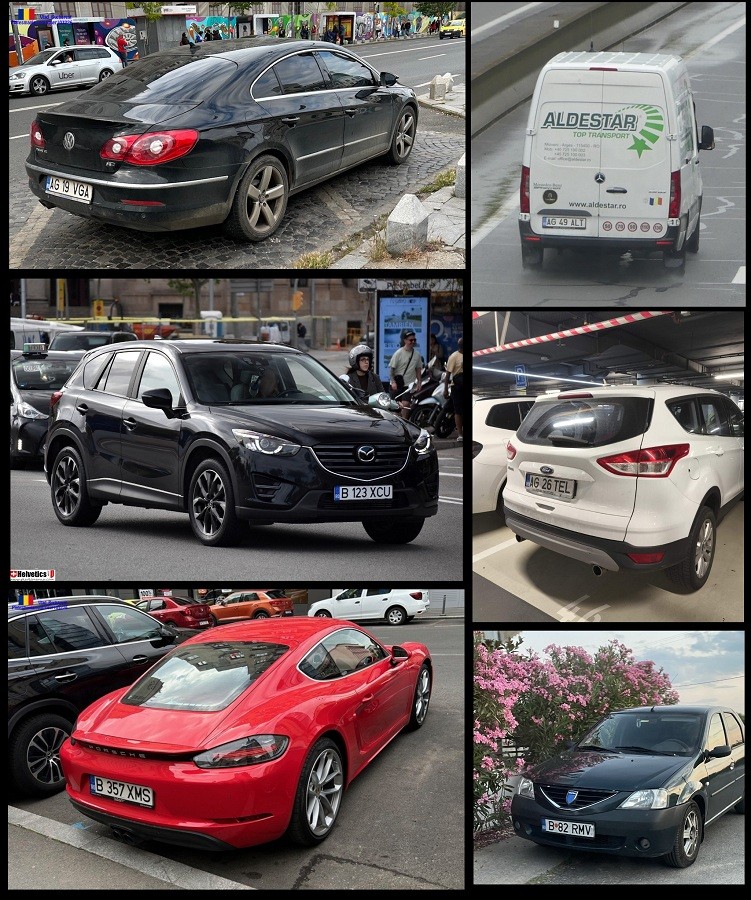
  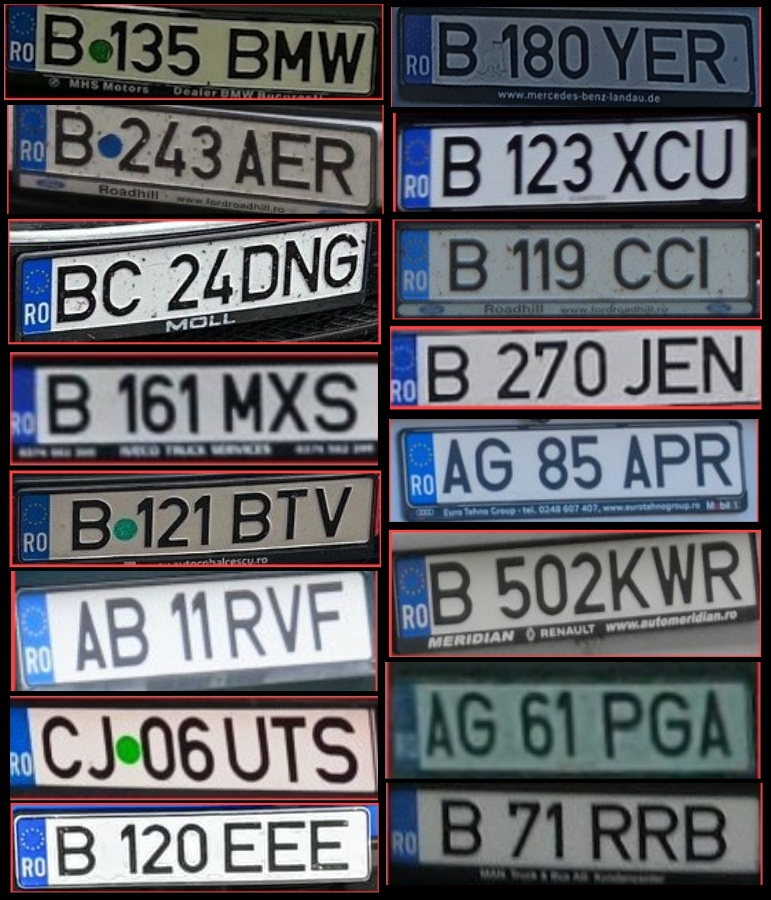
  <br>
  <em>Left: Full vehicle captures from PlatesMania (Source) Right: Extracted & Filtered ROI crops (Input)</em>
</p>

## Configuration

The toolkit is modular, with all distortion parameters managed through **`config.yaml`**. Each effect can be toggled and fine-tuned by adjusting its specific values and execution probability (`p`). For a comprehensive list of all available image augmentations and their technical parameters, please refer to the official [Albumentations Documentation](https://albumentations.ai/docs/).

The current `config.yaml` ships the **severe** parameter set used to build
the synthetic training corpus for the associated LPSR benchmark: eight base
effects plus five combined effects (two base effects chained in sequence)
plus a `LOW_RESOLUTION` effect, for 14 categories in total. An earlier,
milder parameterization of these same 8 base effects (plus a `SKEW`
perspective effect that is no longer part of this set) was used in a prior
iteration of the dataset; the values below are more aggressive and are the
ones reflected in the reported results.

### Available Distortion Effects

To better understand the degradation effects, the visual samples in the table below are generated from the following high-resolution crop:

<p align="center">
  
  <br>
  <em>Original HR License Plate (Ground Truth)</em>
</p>

#### Base effects

| Effect ID | Description | Visual Sample | Albumentations Transforms |
|:---|:---|:---|:--- |
| **`MOTION`** | Motion blur simulation | 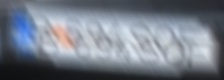 | `MotionBlur` |
| **`DISTANCE`** | Simulates long-range capture | 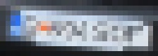 | `Resize` + `Resize` + `GaussianBlur` + `Downscale` |
| **`OBSTRUCTION`** | Partial plate occlusions | 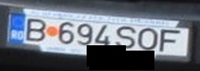 | `CoarseDropout` |
| **`DAY_RAIN`** | Rain in daylight conditions | 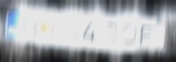 | `RandomRain` + `MotionBlur` |
| **`DAY_SNOW`** | Snow in daylight conditions | 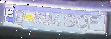 | `RandomSnow` (bleach + texture) |
| **`NIGHT_RAIN`** | Night-time rain simulation | 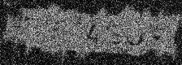 | `RandomRain` + `Brightness/Contrast` + `GaussNoise` + `ToGray` |
| **`NIGHT_SNOW`** | Night-time snow simulation | 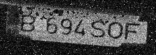 | `RandomSnow` + `Brightness/Contrast` + `GaussNoise` + `ToGray` |
| **`OVEREXPOSURE`** | Strong light overexposure |  | `RandomBrightnessContrast` + `HueSaturationValue` + `MotionBlur` |

`OVEREXPOSURE`'s brightness range is high enough that already-bright plates
(light background, as in the sample above) can wash out almost entirely;
this is intentional for this severe profile, not a bug.

#### Combined and auxiliary effects

Each combined effect applies its named base effects' transforms back to
back, in the order given by its name, reusing the same parameters as the
corresponding base effect above.

| Effect ID | Description | Visual Sample | Composition |
|:---|:---|:---|:---|
| **`MOTION_DISTANCE`** | Motion blur and long-range capture | 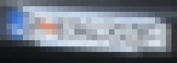 | `MOTION` &rarr; `DISTANCE` |
| **`MOTION_OVEREXPOSURE`** | Motion blur and overexposure | 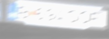 | `MOTION` &rarr; a milder overexposure (see note below) |
| **`MOTION_NIGHT_RAIN`** | Motion blur and night rain | 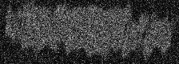 | `MOTION` &rarr; `NIGHT_RAIN` |
| **`DISTANCE_DAY_RAIN`** | Long-range capture with day rain | 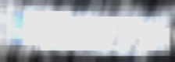 | `DISTANCE` &rarr; `DAY_RAIN` |
| **`DISTANCE_OVEREXPOSURE`** | Long-range capture with overexposure | 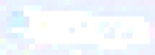 | `DISTANCE` &rarr; `OVEREXPOSURE` |
| **`LOW_RESOLUTION`** | Aggressive downscale/upscale round-trip | 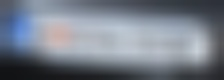 | `Resize` (down) + `GaussianBlur` + `Resize` (up) |

`MOTION_OVEREXPOSURE` is the one exception to plain chaining: applying
`MOTION` followed by the full `OVEREXPOSURE` sequence as-is washes the
plate text out completely on most inputs, so `config.yaml` overrides it
with a deliberately milder overexposure step (lower `val_shift_limit`, no
trailing motion blur) so the plate stays at least partially legible.
Several severe effects and combinations — `OVEREXPOSURE`,
`NIGHT_RAIN`, `MOTION_NIGHT_RAIN`, `DISTANCE_OVEREXPOSURE` — can still
fully obscure the plate depending on the input image; this reflects the
intended difficulty of the profile rather than a configuration error.

## Usage

### Requirements
Install the necessary dependencies:

```bash
pip install opencv-python pillow pyyaml albumentations numpy
```
### Full Dataset Processing

To process all images in the input/ directory:

```bash
python image_distortion_set.py
```

This command will:
1. Read all `.jpg` images from the `input/` folder.
2. Apply every effect defined in `config.yaml`.
3. Save the processed images to the `output/` folder.
4. Generate an `output.txt` file with detailed execution logs.

### Individual Image Processing
To process a single specific image:

```bash
python image_distortion_set.py --file path/to/image.jpg
```

### Naming Convention
Generated files include the specific parameters used during processing within the filename:


Format: `[original_name]_[EFFECT]_[param1]_[param2]_..._[paramN].jpg`

Example:
```
AG24EGK_MOTION_17_31_1p0.jpg
│       │      │  │   │
│       │      │  │   └─ p=1.0 (Probability)
│       │      │  └───── blur_limit max=31
│       │      └──────── blur_limit min=17
│       └─────────────── Effect Type
└─────────────────────── Original Image Name
```

### Directory Structure
```
LPSR-Degradation-Toolkit/
├── config.yaml                    # Effect configurations
├── image_distortion_set.py        # Main distortion script
├── input/                         # Original (HR) images directory
│   ├── plate001.jpg
│   ├── plate002.jpg
│   └── ...
└── output/                        # Processed (LR) images directory
    ├── plate001_MOTION_17_31_1p0.jpg
    ├── plate001_DISTANCE_...jpg
    ├── plate001_LOW_RESOLUTION_...jpg
    └── ...
```
